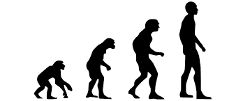
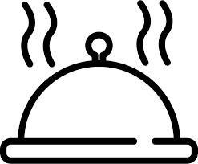
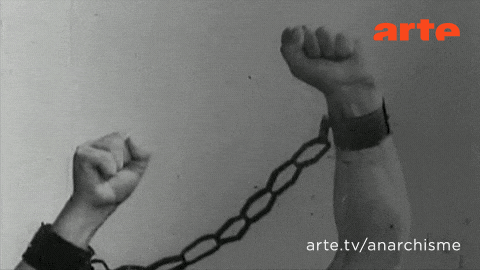

```{r setup, include=FALSE}
knitr::opts_chunk$set(echo = FALSE)
```


## Welcome, blast off
<center></center>


<center>workshop on github </center>

<center>(https://github.com/tercen/highdimcyto_workshop)</center>

## Agenda

- Intro to Tercen concepts (Module 1)
- Quality control (Module 2)
- Dimension reduction (Module 3)
- Clustering (Module 4)
- Differential testing (Module 5)
- Use your own data (Module 6)

# Module One

## Researchers' Challenges

* Get control
* Handle large data sizes
* Integrate any database
* Visualize and interact
* Knowing what algorithm to use


<center></center>

## Tools evolution

* Calculators, log tables (_homo homini_)
* Excel and Graphpad (_homo australopithecus e.g. Lucy_)
* Tercen (_homo habilis_)
* Unknown (_homo sapien_)
<center></center>
## Thus....

<center></center>
<center></center>

## Features

* Store
* Compute
* Visualize

<center></center>


## Concepts and terms

- measurement (e.g. gene expression value)
- variable (e.g. gene)
- observation (e.g. samples )
- annotation (e.g. of genes or sample)

<center>all are factors!!!</center>

## Wide format

```{r results = 'asis'}
data <- read.delim2(file = file.path("..", "data","markers_wide.tsv")) 
knitr::kable(data[, 1:3], align = "lll")
```

## Long format

```{r results = 'asis'}
data <- read.delim2(file = file.path("..", "data","markers_long.tsv")) 
knitr::kable(data[1:6,], align = "lll")
``` 

## Computed table

After a mean operator of all genes per sample:

```{r results = 'asis'}
data <- read.delim2(file = file.path("..", "data","markers_mean.tsv")) 
knitr::kable(data[1:2,], align = "lll")
``` 

## Relational algebra
- how to define a relation between two Tables
- operators create new Tables (but also relations)
- relations between tables
- more info (https://en.wikipedia.org/wiki/Relational_algebra)
- be careful of the vocabulary
- need only understand the concepts

## Univeral table
- Tercen sees all the tables as one big integrated table

## Wrangling

- visual wrangling
- data wrangling
- computational wrangling

```{r echo = FALSE}

pie(c(80,20), labels=c("Wrangle", "Compute"), main="Where is time spent?", col=c("orange","green"), border="white", clockwise=FALSE)

```


## Let's start

- does everyone have the chrome browser installed?
- how many have a laptop with Windows?
- how many have a laptop with Linux?
- how many have a Mac?
- how many do not have a laptop?
- how many have excel, or libreoffice?

## Let's start

Use chrome and go to:

https://test.tercen.com/  

login: `lucy` 

password: `habilis`

## Set up

- Create a team 
   - use your name for the team name
- Create a project
   - use `module1`
- Click on the newly created project
   - There is a new menu on the left
       - `Create a data set`
       - `Create a workflow`
       - `Import a workflow`
   
## Download the data for workshop

To download the data perform the following:

- click on https://raw.githubusercontent.com/tercen/user_workshop/master/data/bodenmiller.csv
- right click and "Save As" onto desktop

## Create the data in Tercen

- click on `Create a data set`
- browse to the data set on your desktop
- click on `OK`

## Create a workflow in Tercen

- click on `Create a workflow`
- give `module1 intro` as workflow name
   - a white canvas appears

## Add table

- right click on canvas and choose `Add`
- select `Table`
- select `bodenmiller`
   - a table step appear on the canvas
- right click on the new table step and choose `Rename`
   - rename it what you like, suggestion: `bodenmiller`
   
## Add data step

- right click on table step and select `Add`
- select `Data step`
   - Data step opens
   
## Configure data step

- drag-n-drop `measurement` to y-axis
- drag-n-drop `Time` to col
- drag-n-drop `marker_name` to row
- drag-n-drop `measurement` to color
- select `heatmap` in drop down menu
- re-size the heatmap


## Welcome to Tercen
<center></center>

<center>...welcome to Tercen...</center>

## Navigating heatmap

- scrolling rows
- scrolling columns
- squashing/expanding rows
- squashing/expanding columns
- squashing/expanding cell/datapoint

## Color palettes

- different types
- different values

## Bar graphs (sample replicates)
- create a bar graph

## Line graphs (marker profiles)
- create a marker profile

## Pairwise marker plots
- create a marker vs marker

## Save workflow

- save icon on workflow tab
- icon disappears when saved

## Project Navigation 

To go up:
The top left icon allows you to navigate to up one level

- click on folder icon, to get up to project
- click on people icon, to get up to team

To go down:

- click on project
- click on workflow
- click on data

## Module One

- why tercen?
- how to navigate
- create project with your name
- create a workflow "module1 intro"
- load bodenmiller dataset
- create a heatmap
- run a `scale` on the data
- run a `asinh` transformation

# Module Two Quality Control

## Recap

- motivation
- table concept
- teams, projects, workflows
- visual wrangling (i.e. projections) using cross-tab
- Agenda Module Two
    + Clustering (TBD)

## Module Two 

- why check?
- create a workflow "module2 QC"
- load Bcells dataset
- run flowai
- exclude the bad cells


# Module Three Dimension Reduction

## Recap

- Agenda Module Three
    + Clustering appraisal (TBD)

## Module Three

- why reduce?
- create a workflow "module2 dimreduction"
- load Bodenmiller dataset
- run tsne, umap and pca
- tsne vs umap discussion

## TSNE vs UMAP


    
## Coffee break

<center></center>

# Module Four Clustering

## Recap

- Agenda Module Four
    + Dimension Reduction (TBD)

## Module Four

- automated vs manual?
- create a workflow "module3 clustering"
- load GvHD dataset
- run flowsom tuning 
- cluster metric discussion

## Clustering Metrics


## Silhouette Metric


# Module Five Differential Analysis

## Recap

## Module Five

- why use differential analysis?
- create a workflow "module4 diff analysis"
- load bodenmiller dataset
- run diffcyto 
- differential cyto discussion

## Lunch

<center></center>

# Module Six

- one-2-one sessions
- practice
- use you own data

## End

<center></center>


## Guides

<left></left>
<right></right>

